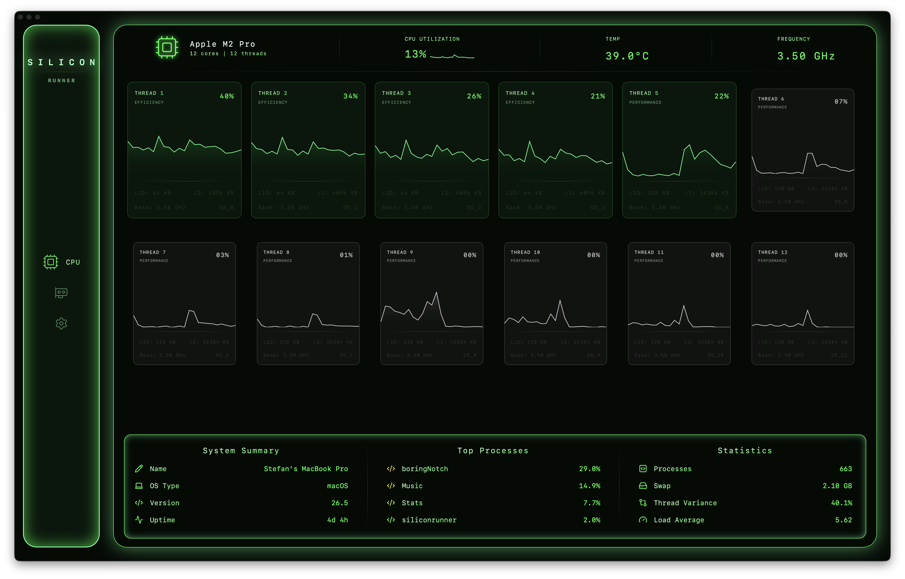
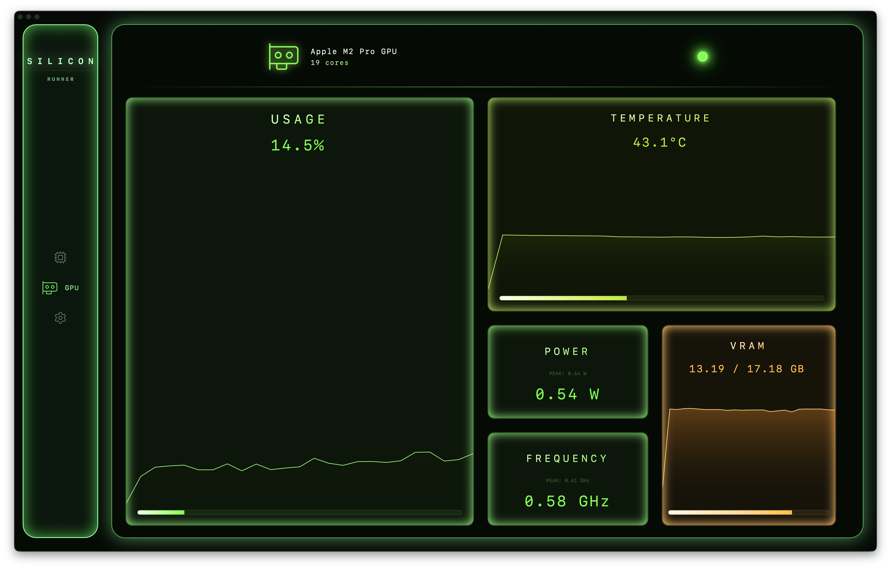

# SiliconRunner

A performance critical CPU diagnostics tool made with Rust, Tauri, and React. SiliconRunner shows a high fidelity x-ray of your processor architecture, visualising per-thread activity.

## Overview

SiliconRunner is a desktop application built to monitor your system's hardware at a granular level.

Whether your machine is idling or rendering shaders, SiliconRunner maps out your hardware topology, per-thread workloads, and power draw – all wrapped in a neon green UI.


## Why?

I wanted a hardware monitor that actually shows me and visualises what hardware I have – down to the cache sizes per thread and distribution of workload across cores.

## Get Started

Head over to the [Releases page](https://github.com/BlueLupa/SiliconRunner/releases/) and download the latest build for your operating system.

**Important Note for macOS Users**

Because SiliconRunner is an independent project without an official Apple Developer Certificate, macOS's Gatekeeper will strictly flag the app as "damaged" and refuse to open it. The file is perfectly safe, it just needs its quarantine flag removed.

After dragging the app into your Applications folder, run this command in the terminal:

```bash
xattr -d com.apple.quarantine /Applications/SiliconRunner.app
```

---

## Stack
- **Backend**: Rust + Tauri
- **Frontend**: React + TypeScript + TailwindCSS + Framer Motion
- **Hardware info:** `sysinfo`, `hwlocality`, `all-smi`, and `macmon`

## Features

### CPU
A high fidelity breakdown of your processor's topology:
- **Per-Thread Cards:** Live line graphs for every individual processing unit
- **Dynamic Cards:** Threads automatically transition between colours and sizes to visualise usage
- **Architectural Stats:** Displays core types (Performance or Efficiency) and L1 & L2 Data Cache sizes
- **More metrics:** A bottom tray that displays global metrics and a compact task manager that exposes heavy processes

> _The `</>` icon on processes can be clicked to quickly end them_



### GPU
A visualisation of your graphics card's state:
- **Metrics:** Tracks Usage, Temperature, VRAM usage, Frequency, and power draw
- **Cross Platform:** Works on any platform without needing `sudo`, including on macOS (uses [macmon](https://github.com/vladkens/macmon) crate)



## License

This project is licensed under the MIT License